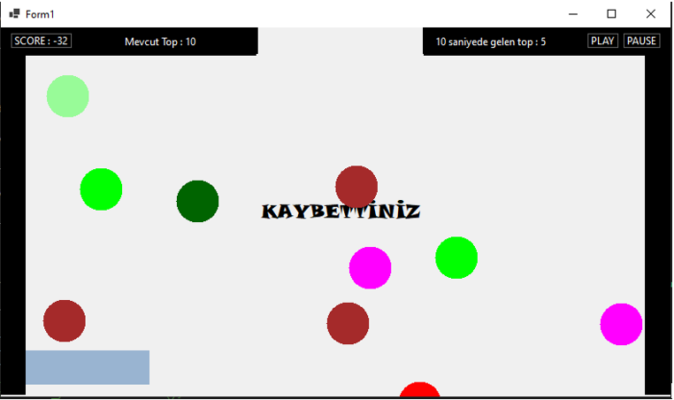
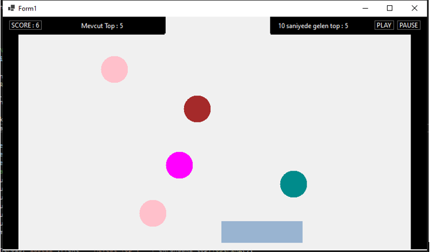
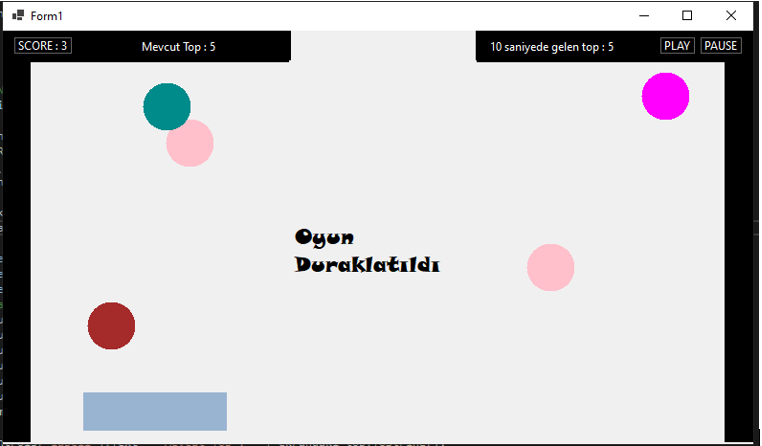
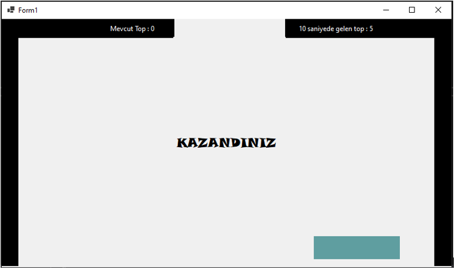

#  Pong Game

<b>Pong Game, C# ile yapılmış belirli kurallar çerçevesinde ilerleyen bir oyundur.</b>

## Uygulamanın Amacı
Oyuncunun ekranda beliren topları sağda ve solda yer alan boşluklardan değil, üstte bulunan boşluktan geçirerek ekranda top kalmamasını sağlamaktır.

 

## Nasıl Kullanılır?
Klavyedeki ⬅️ ve ➡️ yön tuşlarını kullanarak toplarımızı zıplatacak platform hareket ettirilir. Böylelikle toplasrın sağdan ve soldan aşağı düşmesi engellenir.

## Nasıl Kurulur?
WinFormsApp5.sln 'ye çift tıklayarak oyunu oynayabilirsiniz.

 
# 💻 Teknolojiler 
- C# 
- VS

[Linkedin](https://www.linkedin.com/in/ahmet-mert-öz)

[E-posta](ahmetmertoz11@gmail.com)
